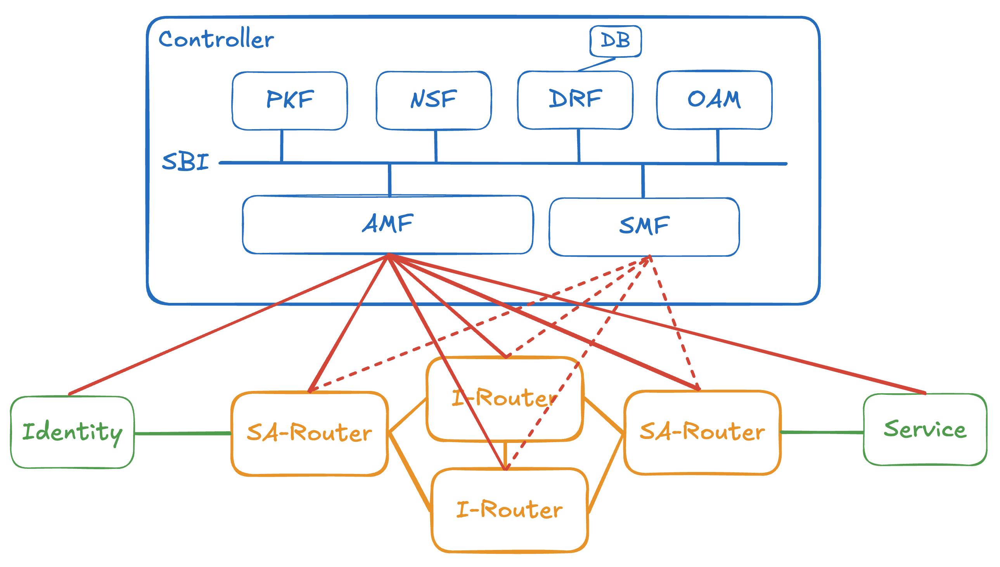

# 00.001 Architecture

## 1. General Architecture

## 2. Control Plane

### 2.1 Controller

### 2.2 SBA (Service Based Architecture)

### 2.3 NFs (Network Functions)

#### 2.3.1 AMF (Assecc Management Function)

#### 2.3.2 SMF (Session Management Function)

#### 2.3.3 PKF (Public Key Function)

#### 2.3.4 NSF (Network Service Function)

#### 2.3.5 DRF (Data Repository Function)

#### 2.3.6 OAM (Operation, Administration, and Maintenance)

## 3. Data Plane

### 3.1 Router

#### 3.1.1 SA-Router (Session Anchor Router)

#### 3.1.2 I-Router (Intermediate Router)

### 3.2 Identity

### 3.3 Service

## 4. Interface and Protocol

### 4.1 N1

### 4.2 N2

### 4.3 N3

### 4.4 N4

### 4.5 N6

### 4.6 N9
