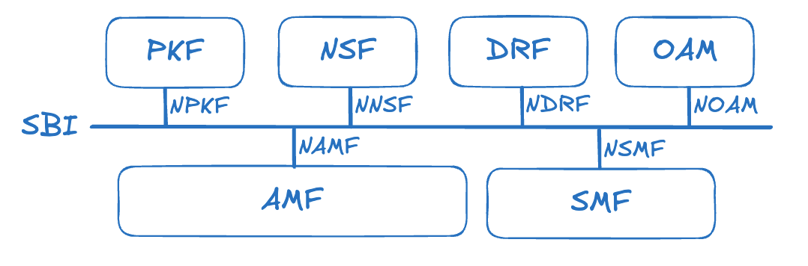
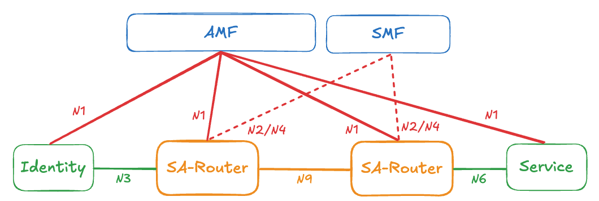

# 00.001 Architecture

## 1. General Architecture

In Veil-link, the overall system consists of three major components: **Controller**, **Router**, and **Identity**.

The **Controller** manages the system by handling identity access (AMF), identity authentication and authorization (PKF), and data-plane session rules (SMF). It also includes internal control network functions, such as OAM, for system operators to manage and access the system. All network functions inside the controller communicate over HTTP for service requests and responses.

On the data plane, the **Router** is the primary forwarding instance that carries user traffic between clients and target service providers. All externally facing data-plane entities (users/clients and routers) must be authorized by PKI-based identities before interacting with either the control plane or the data plane. Service providers are assumed to run in a controlled internal network segment and therefore do not require external authentication in this model.

## 2. Control Plane

The control plane is composed of multiple network functions exposed through service-based interfaces. This makes the controller architecture easier to extend and customize.

### 2.1 Controller

From an external perspective, the controller provides an access interface for new identities to join the system. Each identity must obtain access rights (i.e., be authorized) before it can participate. After authorization, the identity can access target services without knowing their real destination IP:PORT.

### 2.2 SBA (Service Based Architecture)

The **SBA (Service-Based Architecture)** is built on SBIs (**Service-Based Interfaces**) exposed by network functions. You can think of it as a shared “service bus” inside the controller: each network function exposes its service APIs on this bus, and other network functions can discover and call them. In this model, there are two roles—**service provider** (processor) and **service consumer**—and the interactions between them constitute the SBA.

### 2.3 NFs (Network Functions)

An NF (Network Function) is a functional building block (work unit) in the controller. Each NF exposes its own services via the SBI for other NFs to consume.

#### 2.3.1 AMF (Access Management Function)

AMF handles all identity access from outside into the controller, including authentication and authorization. It also forwards signaling messages from identities to internal network functions.

Link to [01.000 AMF](../01-series-nf/01.000-amf.md).

#### 2.3.2 SMF (Session Management Function)

SMF manages the data plane’s logical connections (sessions), including rule generation and rule provisioning/enforcement.

Link to [01.001 SMF](../01-series-nf/01.001-smf.md).

#### 2.3.3 PKF (Public Key Function)

PKF maintains the system’s public key infrastructure (PKI). Identity-related access and operations are performed based on authorized credentials.

Link to [01.002 PKF](../01-series-nf/01.002-pkf.md).

#### 2.3.4 NSF (Network Service Function)

NSF registers and maintains metadata for network services within the controller.

Link to [01.003 NSF](../01-series-nf/01.003-nsf.md).

#### 2.3.5 DRF (Data Repository Function)

DRF provides the data repository layer for the Veil-link system. All database operations should be performed through DRF.

Link to [01.004 DRF](../01-series-nf/01.004-drf.md).

#### 2.3.6 OAM (Operation, Administration, and Maintenance)

OAM provides management interfaces for operators to monitor and administer the Veil-link system.

Link to [01.005 OAM](../01-series-nf/01.005-oam.md).

## 3. Data Plane

### 3.1 Router

The router is the main dataplane component responsible for forwarding user traffic according to controller-provisioned policies and session rules. Routers participate in PKI-based trust with the control plane and form the overlay paths used to reach services.

#### 3.1.1 SA-Router (Session Anchor Router)

The SA-Router terminates and anchors a session on the dataplane. It enforces the per-session forwarding rules and acts as the stable entry/exit point for a given session when paths are updated or re-routed.

Link to [02.000 SA-Router](../02-series-router/02.000-sa-router.md).

#### 3.1.2 I-Router (Intermediate Router)

The I-Router provides intermediate forwarding between routers along a dataplane path. It applies hop-level forwarding rules and supports fast path updates when the control plane recomputes or re-distributes routing intents.

Link to [02.001 I-Router](../02-series-router/02.001-i-router.md).

### 3.2 Identity

Identity refers to authorized clients/users (and other externally facing participants) that access the Veil-link network. An identity is authenticated and authorized by the control plane (e.g., via PKI-backed credentials) and can then initiate sessions to permitted services.

Link to [03.000 Identity](../03-series-identity/03.000-identity.md).

### 3.3 Service

In the dataplane context, **Service does not mean a control-plane NF**. Here, a Service refers to a **dark service**: an internal target service that is intentionally hidden from the public network and is only reachable through Veil-link by specific authorized identities. Identities access the service via routers and policies, without directly learning or exposing the service’s real destination address (e.g., IP:PORT) to the public.

Link to [04.000 Service](../04-series-service/04.000-service.md).

## 4. Interfaces and Protocols

### 4.1 SBI (Service Based Interface)

#### 4.1.1 NAMF

AMF exposes the following services over the SBI:

- Identities

    - GET: get identies

- Event

    - POST: subscribe event
    - PUT: update subscribe event level

#### 4.1.2 NSMF

SMF exposes the following services over the SBI:

- Session

    - POST: create session
    - PUT: update session
    - DELETE: release session

- Routers

    - GET: get routers

- Event

    - POST: subscribe event
    - PUT: update subscribe event level

#### 4.1.3 NPKF

PKF exposes the following services over the SBI:

- JWT

    - GET: generate JWT
    - POST: validate JWT

- Cert

    - GET: generate certificate
    - POST: validate certificate

- Public Key

    - GET: get public key

- Event

    - POST: subscribe event
    - PUT: update subscribe event level

#### 4.1.4 NNSF

NSF exposes the following services over the SBI:

- NF Registration

    - POST: registration
    - DELETE: de-registration

- NF Discovery

    - POST: NF service query

- Event

    - POST: subscribe event
    - PUT: update subscribe event level

#### 4.1.5 NDRF

DRF exposes the following services over the SBI:

- Identiy

    - GET: get identity
    - POST: insert identity
    - PUT: update identity
    - DELETE: delete identity

- Identities

    - GET: get identities

- JWT

    - GET: get JWT, with key or not
    - POST: insert JWT
    - DELETE: delete JWT

- Session

    - GET: get session data

- Event

    - POST: subscribe event
    - PUT: update subscribe event level

#### 4.1.6 NOAM

- Event

    - POST: callback for receiving events

### 4.2 DPI (Data Plane Interface)

#### 4.2.1 N1 - IAP

The N1 interface enables external identities to register with the Veil-link system (AMF) using [IAP (Identity Access Protocol)](../05-series-protocol/05.000-iap.md). Before sending the registration request to AMF, an identity needs to obtain a one-time JWT through OAM or contact an administrator. After registration, each identity will receive a certificate for accessing dark services.

#### 4.2.2 N2 - RAP

The N2 interface enables data plane routers to establish connections with SMF. To access SMF using [RAP (Router Access Protocol)](../05-series-protocol/05.001-rap.md), a router must first register a valid identity via N1 with AMF. Each RAP action requires certificate authorization.

#### 4.2.3 N3 - QUIC

The N3 interface is used for client identities to access the SA-Router, which serves as an entry router to access the Veil-link data plane using [QUIC](../05-series-protocol/05.003-quic.md).

#### 4.2.4 N4 - SMP

The N4 interface is responsible for sending data plane forwarding rules from SMF to routers using [SMP (Session Management Protocol)](../05-series-protocol/05.002-smp.md). This interface connection is established through N2 interaction.

#### 4.2.5 N6 - QUIC

The N6 interface is an outgoing interface for accessing dark services on servers, based on [QUIC](../05-series-protocol/05.003-quic.md).

#### 4.2.6 N9 - QUIC

The N9 interface provides connections between data plane routers using [QUIC](../05-series-protocol/05.003-quic.md) for forwarding data plane packets.
