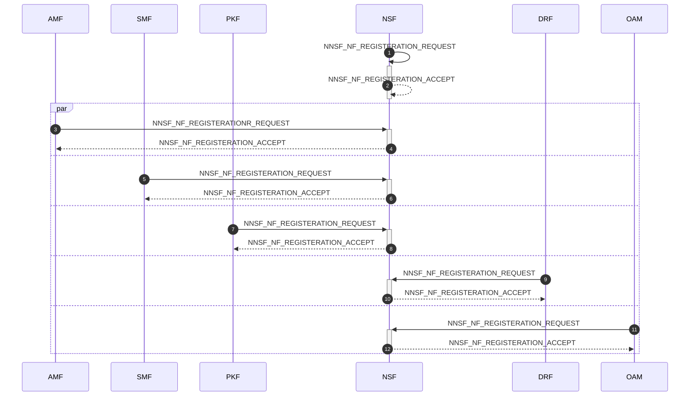
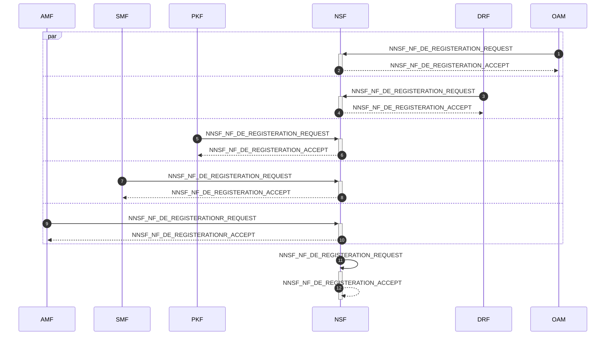
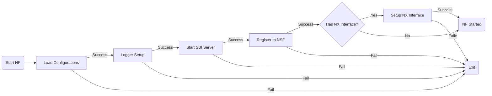
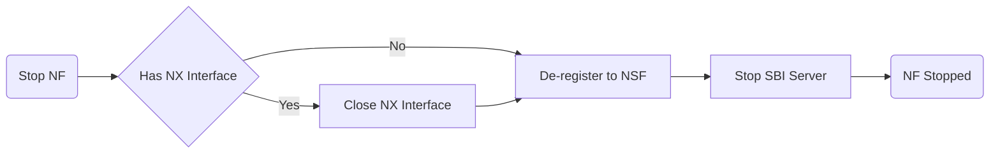
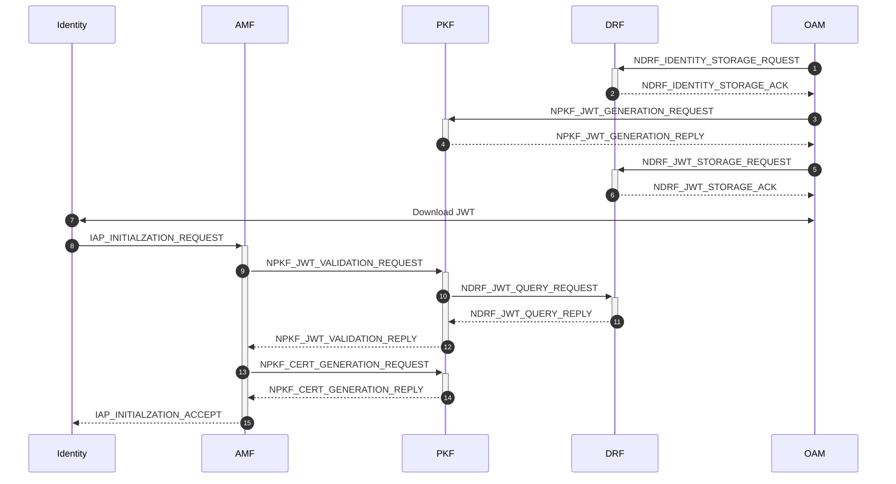
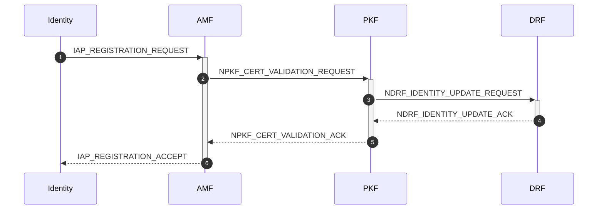
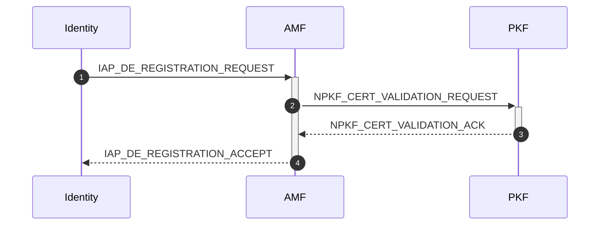

# 00.002 Procedure

## 1. Controller Start/Stop

### 1.1 Controller Start

### 1.2 Controller Stop

## 2. NF Start/Stop

### 2.1 NF Start

### 2.2 NF Stop

## 3. NF Service Access

## 4. Identity Initialization/Registeration/De-registeration

### 4.1 Identity Initialization

### 4.2 Identity Registration

### 4.3 Identity De-registration

## 5. Session Establishment/Modification/Release

### 5.1 Session Establishment

### 5.2 Session Modification

### 5.3 Session Release

## 6. OAM Real-time Monitoring

## 7. QUIC Forward
