# 00.002 Procedure

## 1. Controller Start/Stop

### 1.1 Controller Start

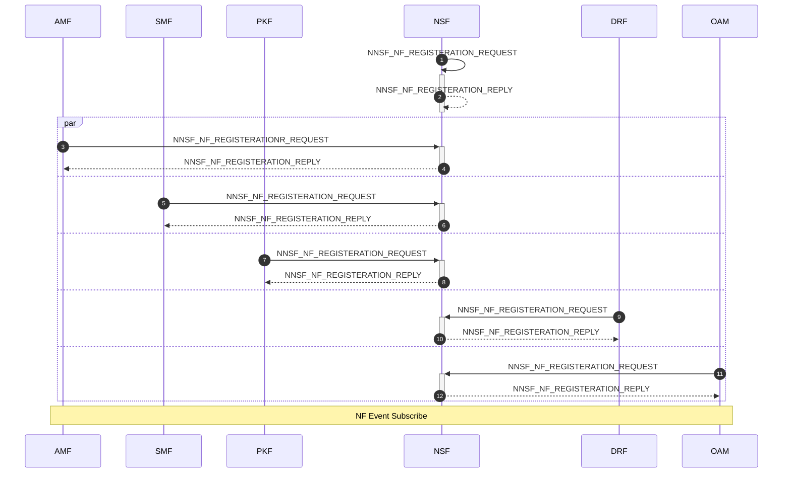

### 1.2 Controller Stop


## 2. NF Start/Stop

### 2.1 NF Start

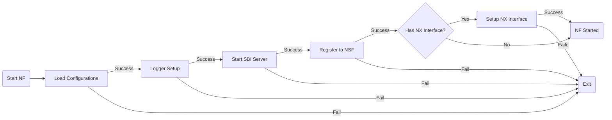

### 2.2 NF Stop

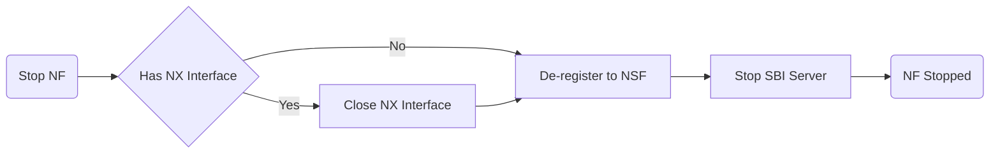

## 3. NF Service Access

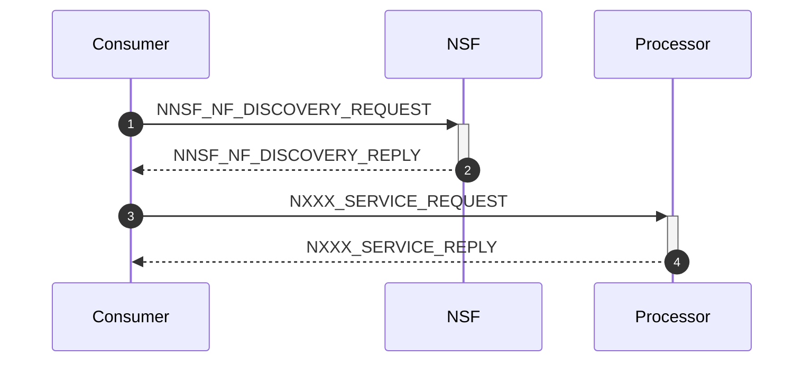

## 4. Identity Initialization/Registeration/De-registeration

### 4.1 Identity Initialization

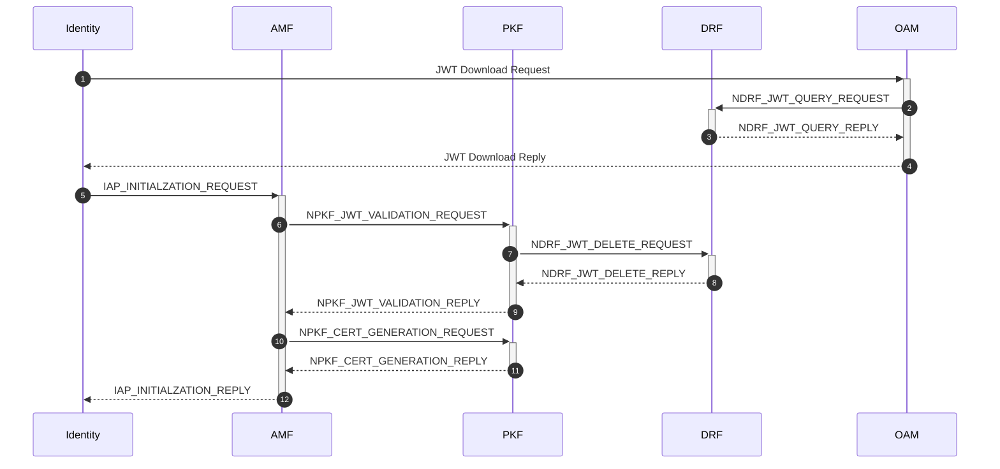

### 4.2 Identity Registration


### 4.3 Identity De-registration


## 5. Router Session Establishment/Release

### 5.1 Router Session Establishment

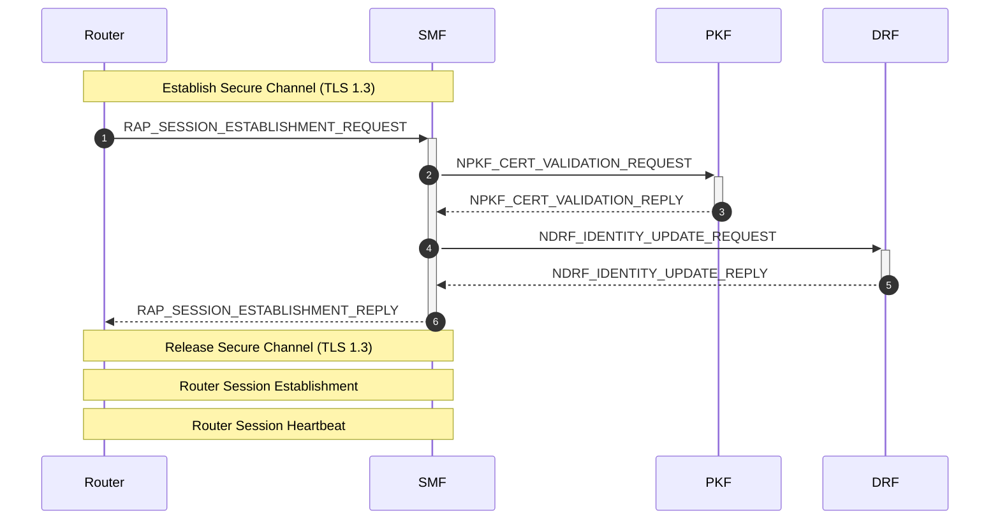

### 5.2 Router Session Release

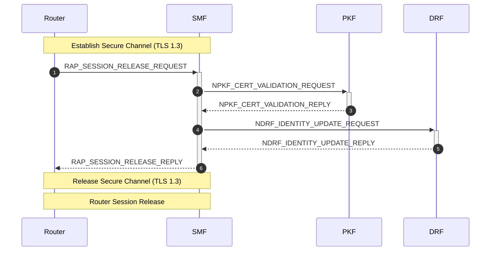

## 6. Session Establishment/Modification/Release

### 6.1 Session Establishment


### 6.2 Session Modification


### 6.3 Session Release


## 7. OAM Interaction

### 7.1 Identity Creation/Modification/Delete

#### 7.1.1 Identity Creation

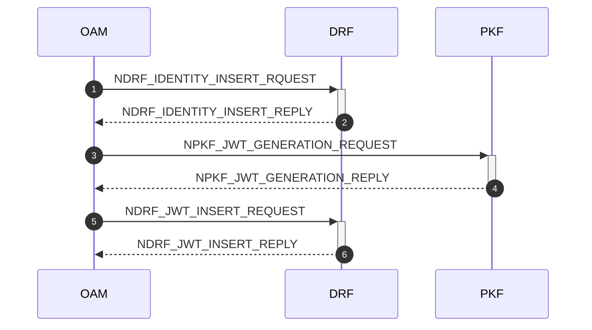

#### 7.1.2 Identity Modification

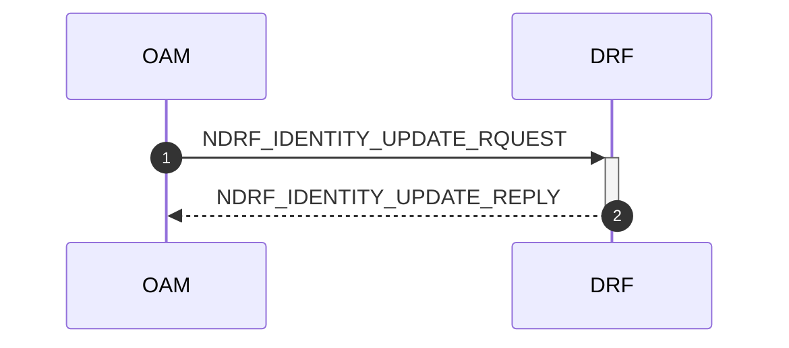

#### 7.1.3 Identity Delete


### 7.2 Status Monitoring

#### 7.2.1 NF Event Subscribe/Receive/Modify

##### 7.2.1.1 NF Event Subscribe

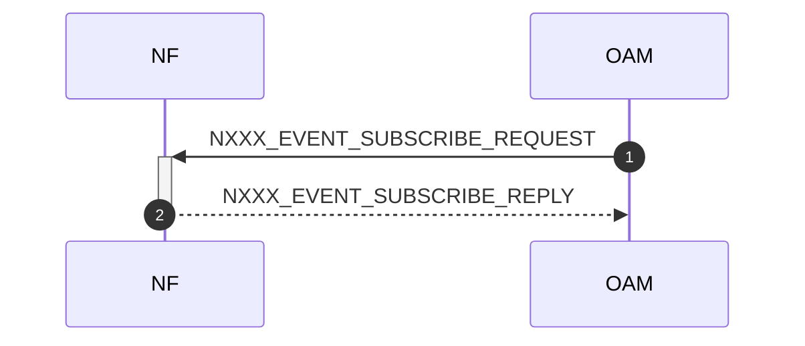

##### 7.2.1.2 NF Event Receive

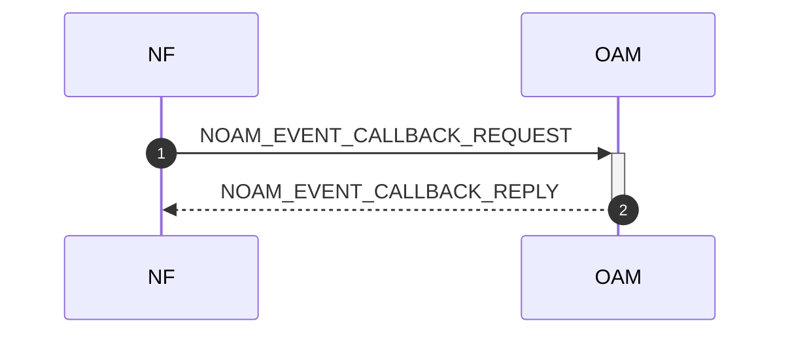

##### 7.2.1.3 NF Event Update

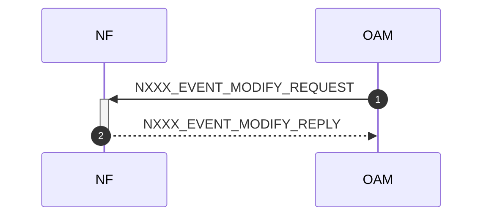

#### 7.2.2 Identity

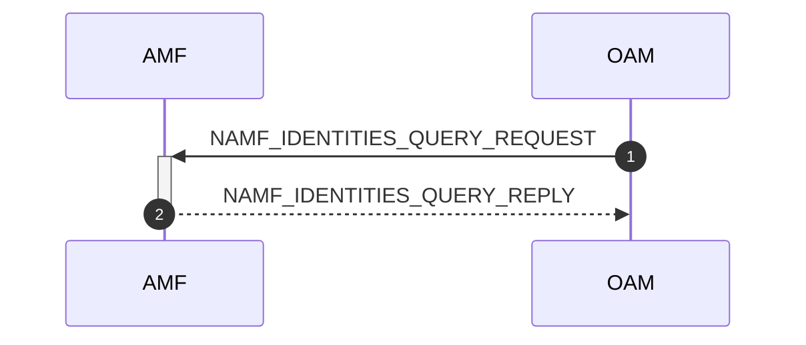

#### 7.2.3 Router

```mermaid
sequenceDiagram
    autonumber

    participant smf as SMF
    participant oam as OAM

    oam ->>+ smf: NSMF_ROUTERS_QUERY_REQUEST
    smf -->>- oam: NAMF_ROUTERS_QUERY_REPLY
```

## 8. QUIC Forward
