# 00.002 Procedure

## 1. Controller Start/Stop

### 1.1 Controller Start

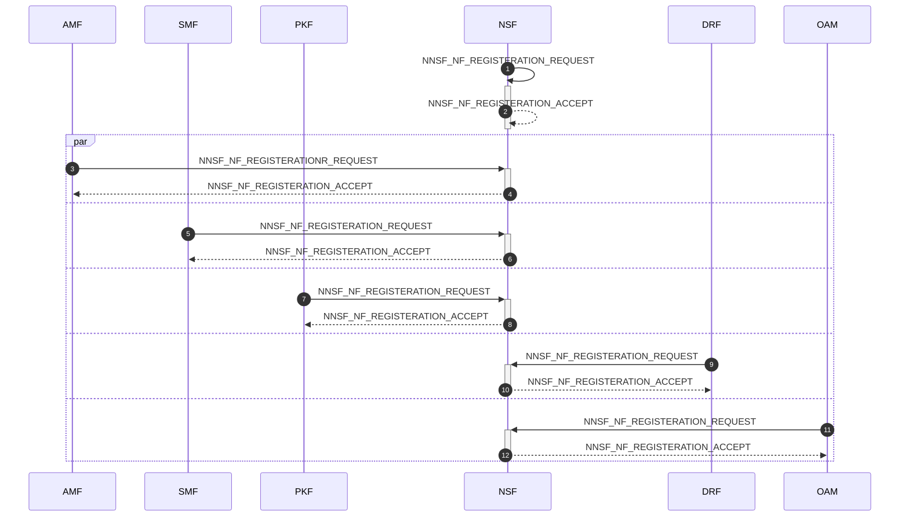

### 1.2 Controller Stop

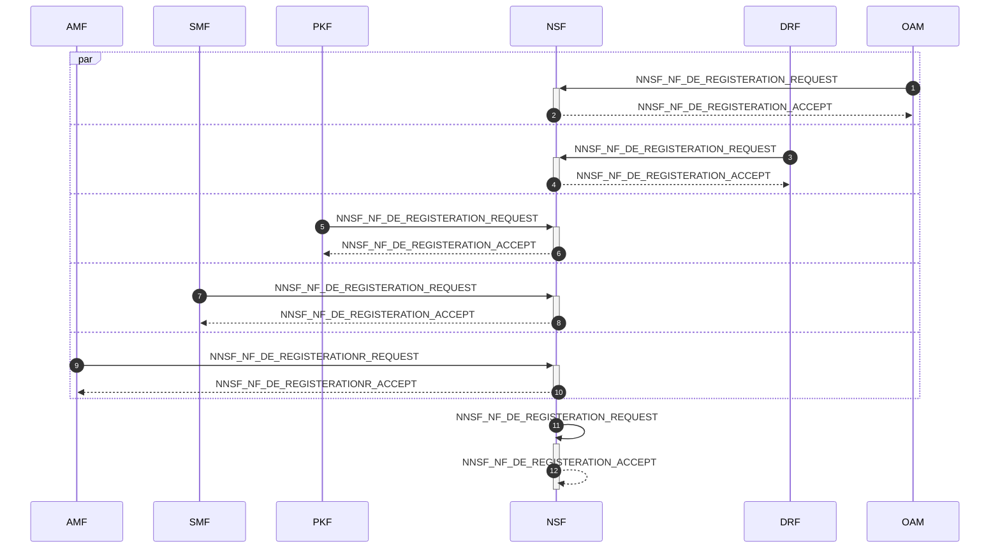

## 2. NF Start/Stop

### 2.1 NF Start

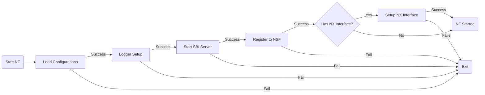

### 2.2 NF Stop

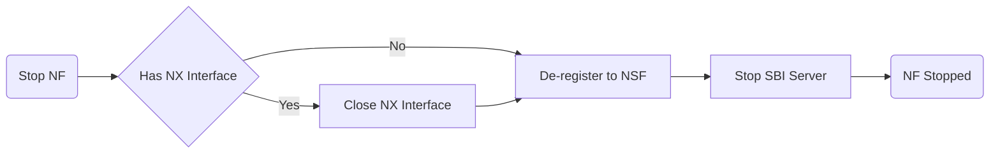

## 3. NF Service Access

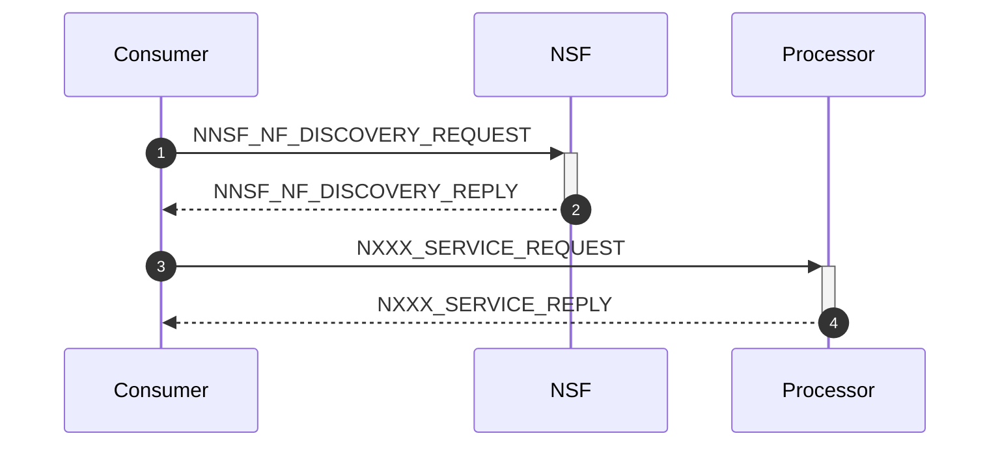

## 4. Identity Initialization/Registeration/De-registeration

### 4.1 Identity Initialization

### 4.2 Identity Registration

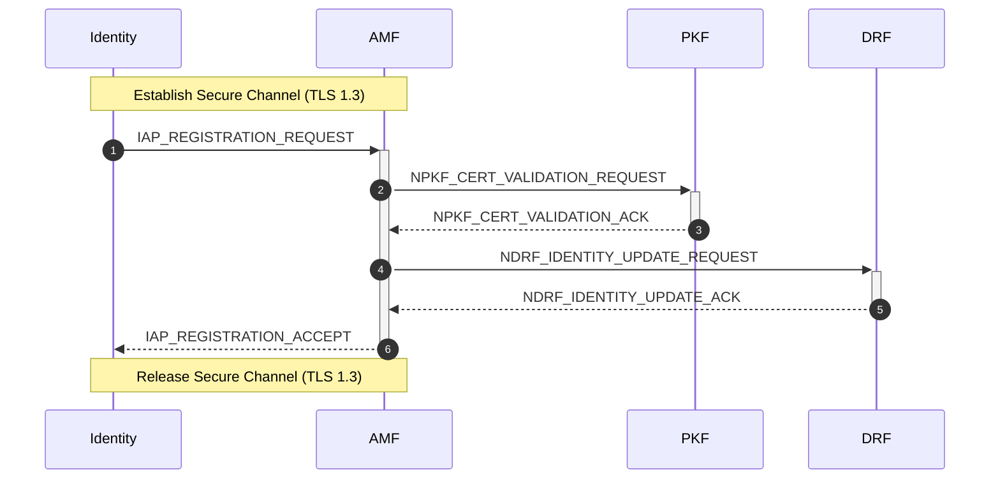

### 4.3 Identity De-registration

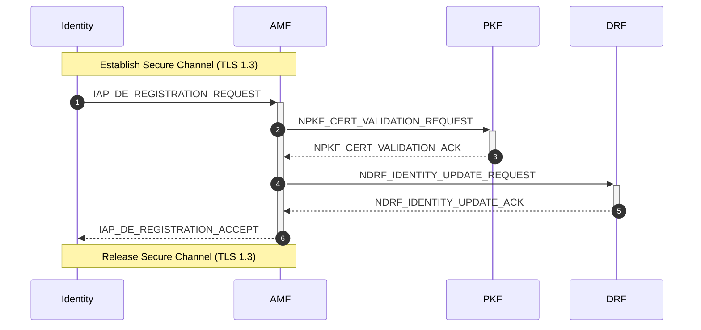

## 5. Router Session Establishment/Release

### 5.1 Router Session Establishment

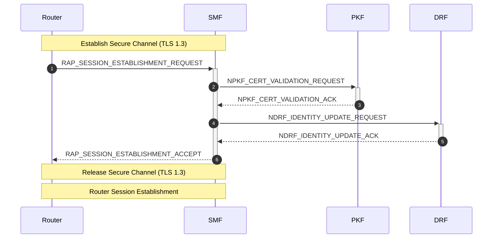

### 5.2 Router Session Release

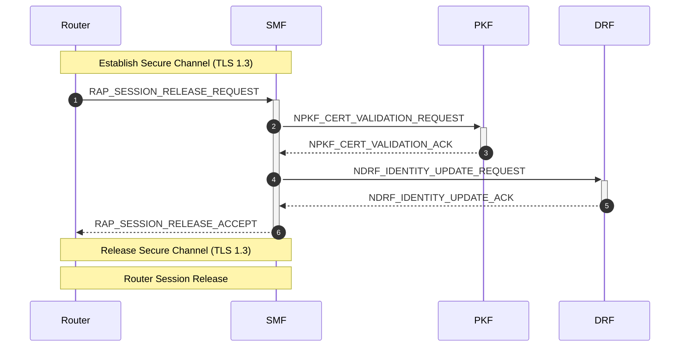

## 6. Session Establishment/Modification/Release

### 6.1 Session Establishment

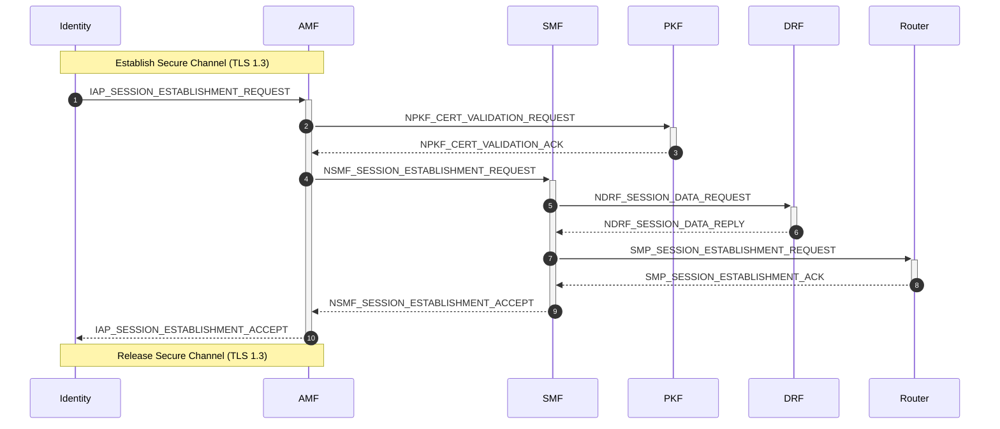

### 6.2 Session Modification

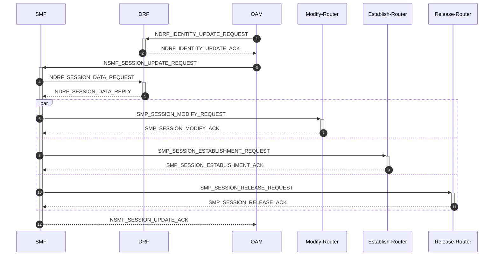

### 6.3 Session Release

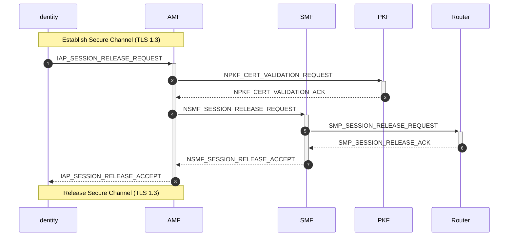

## 7. OAM Interaction

## 7.1 Identity Creation/Modification/Delete

### 7.1.1 Identity Creation

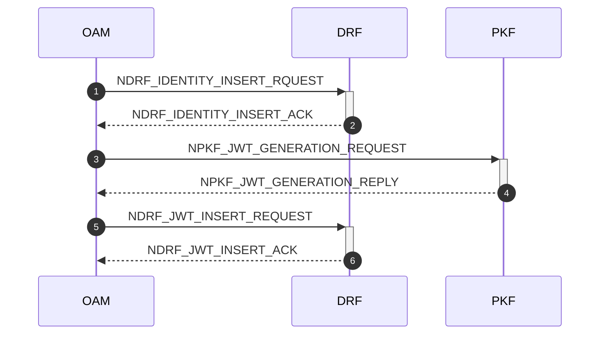

### 7.1.2 Identity Modification

### 7.1.3 Identity Delete

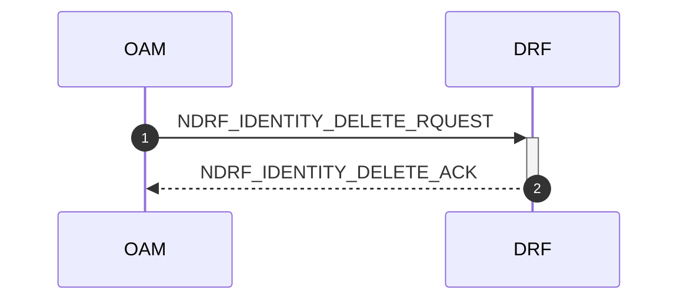

## 8. QUIC Forward
